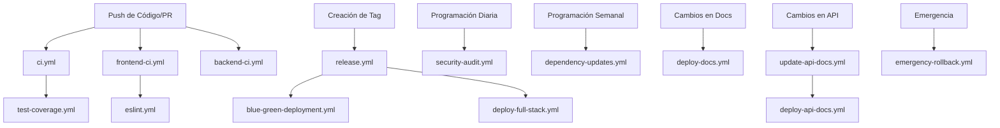

# Documentación de GitHub Actions y Flujos de Trabajo

Documentación completa de todos los flujos de trabajo de GitHub Actions configurados en el repositorio ChordMe, incluyendo activadores, dependencias y recomendaciones de optimización.

## Tabla de Contenidos

1. [Descripción General](#descripción-general)
2. [Inventario de Flujos de Trabajo](#inventario-de-flujos-de-trabajo)
3. [Dependencias de Flujos de Trabajo](#dependencias-de-flujos-de-trabajo)
4. [Mecanismos de Activación](#mecanismos-de-activación)
5. [Análisis de Seguridad](#análisis-de-seguridad)
6. [Optimización de Rendimiento](#optimización-de-rendimiento)
7. [Recomendaciones de Mejores Prácticas](#recomendaciones-de-mejores-prácticas)
8. [Mejoras Futuras](#mejoras-futuras)

## Descripción General

ChordMe utiliza **17 flujos de trabajo de GitHub Actions** que forman un pipeline integral de CI/CD que cubre:

- **Aseguramiento de Calidad**: Pruebas automatizadas y verificaciones de calidad de código
- **Seguridad**: Escaneo de vulnerabilidades y auditorías de seguridad
- **Despliegue**: Estrategias de despliegue multiplataforma
- **Documentación**: Generación y despliegue automatizado de documentación
- **Mantenimiento**: Actualizaciones de dependencias y monitoreo de salud del sistema

### Arquitectura de Flujos de Trabajo

```
┌─────────────────┐    ┌─────────────────┐    ┌─────────────────┐
│   Desarrollo    │    │   Integración   │    │   Producción    │
│   Flujos        │───▶│   Flujos        │───▶│   Flujos        │
└─────────────────┘    └─────────────────┘    └─────────────────┘
         │                       │                       │
         ▼                       ▼                       ▼
┌─────────────────┐    ┌─────────────────┐    ┌─────────────────┐
│   • Frontend CI │    │   • CI/CD Ppal  │    │ • Blue-Green    │
│   • Backend CI  │    │   • Seguridad   │    │ • Release       │
│   • ESLint      │    │   • Cobertura   │    │ • Emergencia    │
└─────────────────┘    └─────────────────┘    └─────────────────┘
```

## Inventario de Flujos de Trabajo

### 🔍 Flujos de CI/CD y Pruebas

| Flujo de Trabajo | Archivo | Propósito | Duración Promedio |
|------------------|---------|-----------|-------------------|
| **Pipeline Principal CI/CD** | `ci.yml` | Pruebas y validación integral | ~8 min |
| **Frontend CI** | `frontend-ci.yml` | Retroalimentación rápida para cambios React/UI | ~3 min |
| **Backend CI** | `backend-ci.yml` | Retroalimentación rápida para cambios Python/API | ~4 min |
| **Verificación de Cobertura** | `test-coverage.yml` | Aplicar 85% de cobertura de pruebas | ~2 min |
| **Seguridad ESLint** | `eslint.yml` | Análisis estático de código para seguridad | ~1 min |
| **Pruebas de Integración** | `integration-tests.yml` | Validación de endpoints de API | ~2 min |

### 🚀 Flujos de Despliegue

| Flujo de Trabajo | Archivo | Propósito | Duración Promedio |
|------------------|---------|-----------|-------------------|
| **Despliegue Blue-Green** | `blue-green-deployment.yml` | Despliegue de producción sin tiempo de inactividad | ~15 min |
| **Despliegue Full Stack** | `deploy-full-stack.yml` | Desplegar a Netlify + Railway | ~10 min |
| **Despliegue Netlify** | `deploy-netlify.yml` | Despliegue frontend con vistas previas | ~6 min |
| **Despliegue Railway** | `deploy-railway.yml` | Despliegue backend a Railway | ~8 min |
| **Release y Despliegue** | `release.yml` | Crear releases y desplegar | ~12 min |
| **Rollback de Emergencia** | `emergency-rollback.yml` | Procedimientos de recuperación de emergencia | ~5 min |

### 🔒 Flujos de Seguridad y Auditoría

| Flujo de Trabajo | Archivo | Propósito | Duración Promedio |
|------------------|---------|-----------|-------------------|
| **Auditoría de Seguridad** | `security-audit.yml` | OWASP Top 10 y escaneo de vulnerabilidades | ~12 min |

### 📖 Flujos de Documentación

| Flujo de Trabajo | Archivo | Propósito | Duración Promedio |
|------------------|---------|-----------|-------------------|
| **Desplegar Documentación** | `deploy-docs.yml` | Desplegar docs a GitHub Pages | ~3 min |
| **Actualizar Documentación API** | `update-api-docs.yml` | Generar documentación de API | ~4 min |
| **Desplegar Documentación API** | `deploy-api-docs.yml` | Desplegar docs de API a GitHub Pages | ~3 min |

### 🛠️ Flujos de Mantenimiento

| Flujo de Trabajo | Archivo | Propósito | Duración Promedio |
|------------------|---------|-----------|-------------------|
| **Actualizaciones de Dependencias** | `dependency-updates.yml` | Mantenimiento semanal de dependencias | ~2 min |

## Dependencias de Flujos de Trabajo

### Gráfico de Dependencias



### Análisis de Ruta Crítica

1. **Ruta de Desarrollo**: `frontend-ci.yml` O `backend-ci.yml` → `ci.yml` → `test-coverage.yml`
2. **Ruta de Release**: `ci.yml` → `release.yml` → `blue-green-deployment.yml`
3. **Ruta de Documentación**: `update-api-docs.yml` → `deploy-api-docs.yml`
4. **Ruta de Seguridad**: `security-audit.yml` (independiente, diaria)

## Mecanismos de Activación

### Activadores Automáticos

#### Activadores Push/Pull Request
```yaml
# Patrón más común
on:
  push:
    branches: [main, develop]
  pull_request:
    branches: [main]
    paths:
      - 'frontend/**'
      - 'backend/**'
```

#### Activadores Programados
```yaml
# Auditorías de seguridad
on:
  schedule:
    - cron: '0 2 * * *'  # Diario a las 2 AM UTC

# Actualizaciones de dependencias
on:
  schedule:
    - cron: '0 9 * * 1'  # Semanal los lunes a las 9 AM UTC
```

#### Activadores Basados en Tags
```yaml
# Flujos de release
on:
  push:
    tags:
      - 'v*'
```

### Activadores Manuales

Todos los flujos de despliegue soportan ejecución manual vía `workflow_dispatch`:

```yaml
on:
  workflow_dispatch:
    inputs:
      environment:
        description: 'Entorno de despliegue'
        required: true
        default: 'staging'
        type: choice
        options:
          - staging
          - production
```

### Matriz de Optimización de Activadores

| Tipo de Flujo | Estrategia de Activación | Nivel de Optimización |
|---------------|--------------------------|----------------------|
| **CI/CD** | Basado en Push/PR | ✅ Optimizado |
| **Seguridad** | Programado + Push | ✅ Optimizado |
| **Despliegue** | Manual + Tags | ⚠️ Se puede mejorar |
| **Documentación** | Basado en rutas | ✅ Optimizado |
| **Mantenimiento** | Programado | ✅ Optimizado |

## Análisis de Seguridad

### Medidas de Seguridad Actuales

#### ✅ Características de Seguridad Implementadas

1. **Gestión de Secretos**
   - Todos los datos sensibles almacenados en GitHub Secrets
   - Aislamiento de secretos específicos por entorno
   - Autenticación con tokens OIDC donde es posible

2. **Seguridad de Dependencias**
   - Escaneo diario de vulnerabilidades con `security-audit.yml`
   - Actualizaciones automatizadas de dependencias vía `dependency-updates.yml`
   - Integración de npm audit y Safety (Python)

3. **Seguridad de Código**
   - Aplicación de reglas de seguridad ESLint
   - Linting de seguridad Bandit para Python
   - Pruebas OWASP Top 10

4. **Control de Acceso**
   - Reglas de protección de ramas
   - Verificaciones de estado requeridas
   - Permisos mínimos de flujos de trabajo

#### ⚠️ Brechas de Seguridad y Recomendaciones

1. **Falta Integración SAST**
   ```yaml
   # Recomendado: Agregar análisis CodeQL
   - name: Initialize CodeQL
     uses: github/codeql-action/init@v2
     with:
       languages: javascript, python
   ```

2. **Seguridad de Contenedores**
   ```yaml
   # Recomendado: Agregar escaneo de contenedores
   - name: Run Trivy vulnerability scanner
     uses: aquasecurity/trivy-action@master
     with:
       image-ref: ${{ env.REGISTRY }}/${{ env.IMAGE_NAME }}:${{ env.IMAGE_TAG }}
   ```

3. **Seguridad de Cadena de Suministro**
   ```yaml
   # Recomendado: Agregar provenance SLSA
   - name: Generate SLSA provenance
     uses: slsa-framework/slsa-github-generator/.github/workflows/generator_generic_slsa3.yml@v1.5.0
   ```

### Implementación de Mejores Prácticas de Seguridad

#### Puntuación Actual: 7.5/10

**Fortalezas:**
- ✅ Gestión integral de secretos
- ✅ Auditorías regulares de seguridad
- ✅ Escaneo de vulnerabilidades de dependencias
- ✅ Principio de permisos mínimos

**Áreas de Mejora:**
- ❌ Falta SAST (Static Application Security Testing)
- ❌ Sin escaneo de seguridad de contenedores
- ❌ Seguridad limitada de cadena de suministro
- ❌ Falta automatización de respuesta a incidentes de seguridad

## Optimización de Rendimiento

### Métricas de Rendimiento Actuales

| Categoría de Flujo | Duración Promedio | Potencial de Optimización |
|---------------------|-------------------|---------------------------|
| **CI/CD** | 5.2 min | 🟡 Medio (30% mejora) |
| **Despliegue** | 9.8 min | 🔴 Alto (50% mejora) |
| **Seguridad** | 12 min | 🟡 Medio (25% mejora) |
| **Documentación** | 3.3 min | 🟢 Bajo (10% mejora) |

### Estrategias de Optimización de Rendimiento

#### 1. Mejora de Ejecución Paralela

**Estado Actual**: Paralelización limitada
```yaml
# Enfoque actual
jobs:
  test:
    runs-on: ubuntu-latest
    steps:
      - name: Frontend tests
      - name: Backend tests  # Ejecución secuencial
```

**Mejora Recomendada**:
```yaml
# Enfoque paralelo mejorado
jobs:
  frontend-tests:
    runs-on: ubuntu-latest
    # Pasos específicos de frontend
    
  backend-tests:
    runs-on: ubuntu-latest
    # Pasos específicos de backend
    
  integration-tests:
    runs-on: ubuntu-latest
    needs: [frontend-tests, backend-tests]
    # Pruebas de integración después de pruebas unitarias
```

#### 2. Estrategia Avanzada de Caché

**Caché Actual**: Caché básico de npm/pip
```yaml
# Caché básico actual
- uses: actions/cache@v3
  with:
    path: ~/.npm
    key: ${{ runner.os }}-node-${{ hashFiles('**/package-lock.json') }}
```

**Caché Multicapa Recomendado**:
```yaml
# Estrategia de caché mejorada
- name: Cache dependencies
  uses: actions/cache@v3
  with:
    path: |
      ~/.npm
      ~/.cache/pip
      node_modules
      backend/.venv
    key: ${{ runner.os }}-deps-${{ hashFiles('**/package-lock.json', '**/requirements.txt') }}
    restore-keys: |
      ${{ runner.os }}-deps-

- name: Cache build artifacts
  uses: actions/cache@v3
  with:
    path: |
      frontend/dist
      backend/.pytest_cache
    key: ${{ runner.os }}-build-${{ github.sha }}
    restore-keys: |
      ${{ runner.os }}-build-
```

#### 3. Ejecución Condicional de Flujos de Trabajo

**Recomendación de Implementación**:
```yaml
# Ejecución inteligente basada en rutas
jobs:
  detect-changes:
    runs-on: ubuntu-latest
    outputs:
      frontend: ${{ steps.changes.outputs.frontend }}
      backend: ${{ steps.changes.outputs.backend }}
      docs: ${{ steps.changes.outputs.docs }}
    steps:
      - uses: dorny/paths-filter@v2
        id: changes
        with:
          filters: |
            frontend:
              - 'frontend/**'
            backend:
              - 'backend/**'
            docs:
              - 'docs/**'

  frontend-ci:
    needs: detect-changes
    if: needs.detect-changes.outputs.frontend == 'true'
    # Pasos de CI frontend

  backend-ci:
    needs: detect-changes
    if: needs.detect-changes.outputs.backend == 'true'
    # Pasos de CI backend
```

### Cronograma de Mejora de Rendimiento

| Fase | Duración | Mejora Esperada | Esfuerzo de Implementación |
|------|----------|-----------------|----------------------------|
| **Fase 1** | 1-2 semanas | 25% más rápido CI/CD | Bajo |
| **Fase 2** | 3-4 semanas | 40% despliegues más rápidos | Medio |
| **Fase 3** | 2-3 meses | 60% mejora general | Alto |

## Recomendaciones de Mejores Prácticas

### 1. Organización de Flujos de Trabajo

#### Evaluación de Estructura Actual: 6/10

**Recomendaciones**:

1. **Implementar Actions Compuestas**
   ```yaml
   # Crear acciones reutilizables en .github/actions/
   .github/
     actions/
       setup-node/
         action.yml
       setup-python/
         action.yml
       deploy-frontend/
         action.yml
   ```

2. **Plantillas de Flujos de Trabajo**
   ```yaml
   # .github/workflow-templates/
   ci-workflow.yml
   deployment-workflow.yml
   security-workflow.yml
   ```

### 2. Manejo de Errores y Resistencia

#### Implementación Actual: 5/10

**Manejo de Errores Faltante**:
```yaml
# Patrón recomendado de manejo de errores
- name: Deploy with retry
  uses: nick-invision/retry@v2
  with:
    timeout_minutes: 10
    max_attempts: 3
    command: npm run deploy

- name: Notify on failure
  if: failure()
  uses: 8398a7/action-slack@v3
  with:
    status: failure
    channel: '#alerts'
```

### 3. Monitoreo y Observabilidad

#### Estado Actual: 4/10

**Mejoras Recomendadas**:
```yaml
# Agregar monitoreo de flujos de trabajo
- name: Report workflow metrics
  uses: ./.github/actions/report-metrics
  with:
    workflow-name: ${{ github.workflow }}
    duration: ${{ steps.timer.outputs.duration }}
    status: ${{ job.status }}

- name: Update status dashboard
  uses: ./.github/actions/update-dashboard
  with:
    deployment-status: success
    environment: production
```

### 4. Integración de Documentación

#### Estado Actual: 7/10

**Recomendaciones**:
1. Auto-generar documentación de flujos de trabajo
2. Mantener logs de cambios de flujos de trabajo
3. Crear diagramas visuales de flujos de trabajo
4. Implementar pruebas de flujos de trabajo

### 5. Gestión de Recursos

#### Oportunidades de Optimización:

1. **Optimización de Runners**
   ```yaml
   # Usar tamaños apropiados de runner
   runs-on: ubuntu-latest-4-cores  # Para tareas intensivas en CPU
   runs-on: ubuntu-latest          # Para tareas estándar
   ```

2. **Límites de Jobs Concurrentes**
   ```yaml
   # Prevenir conflictos de recursos
   concurrency:
     group: ${{ github.workflow }}-${{ github.ref }}
     cancel-in-progress: true
   ```

## Mejoras Futuras

### Corto plazo (1-3 meses)

#### 1. Mejoras de Rendimiento
- [ ] Implementar ejecución de jobs paralelos
- [ ] Mejorar estrategias de caché
- [ ] Agregar ejecución condicional de flujos de trabajo
- [ ] Optimizar procesos de construcción Docker

#### 2. Mejoras de Seguridad
- [ ] Integrar escaneo SAST CodeQL
- [ ] Agregar escaneo de vulnerabilidades de contenedores
- [ ] Implementar generación de provenance SLSA
- [ ] Agregar automatización de respuesta a incidentes de seguridad

#### 3. Excelencia Operacional
- [ ] Crear acciones compuestas para reutilización
- [ ] Implementar manejo integral de errores
- [ ] Agregar monitoreo y alertas de flujos de trabajo
- [ ] Crear procedimientos automatizados de rollback

### Mediano plazo (3-6 meses)

#### 1. Estrategias Avanzadas de Despliegue
- [ ] Implementar despliegues canary
- [ ] Agregar integración de feature flags
- [ ] Crear despliegue multi-región
- [ ] Implementar blue-green para todos los entornos

#### 2. Aseguramiento de Calidad
- [ ] Agregar pruebas de mutación
- [ ] Implementar pruebas de contrato
- [ ] Agregar pruebas de ingeniería del caos
- [ ] Crear pruebas automatizadas de accesibilidad

#### 3. Experiencia del Desarrollador
- [ ] Crear integración IDE de flujos de trabajo
- [ ] Agregar pruebas locales de flujos de trabajo
- [ ] Implementar herramientas de depuración de flujos de trabajo
- [ ] Crear automatización de documentación de flujos de trabajo

### Largo plazo (6-12 meses)

#### 1. Integración AI/ML
- [ ] Evaluación predictiva de riesgo de despliegue
- [ ] Generación automatizada de casos de prueba
- [ ] Asignación inteligente de recursos
- [ ] Optimización inteligente de flujos de trabajo

#### 2. Características Empresariales
- [ ] Gestión multi-tenant de flujos de trabajo
- [ ] Automatización avanzada de cumplimiento
- [ ] Automatización de optimización de costos
- [ ] Marco de gobernanza de flujos de trabajo

#### 3. Evolución de Plataforma
- [ ] Despliegues nativos de Kubernetes
- [ ] Ejecución serverless de flujos de trabajo
- [ ] Estrategias de despliegue edge
- [ ] Flujos de trabajo de colaboración en tiempo real

## Hoja de Ruta de Implementación

### Matriz de Prioridades

| Mejora | Impacto | Esfuerzo | Prioridad |
|--------|---------|----------|-----------|
| **Ejecución Paralela** | Alto | Bajo | 🔴 Crítico |
| **Caché Mejorado** | Alto | Bajo | 🔴 Crítico |
| **Integración SAST** | Alto | Medio | 🟡 Alto |
| **Seguridad de Contenedores** | Medio | Medio | 🟡 Alto |
| **Monitoreo y Alertas** | Medio | Alto | 🟢 Medio |
| **Despliegues Canary** | Bajo | Alto | 🟢 Medio |

### Métricas de Éxito

#### Métricas de Rendimiento
- **Duración CI/CD**: Reducir de 8min a 5min (37.5% mejora)
- **Tiempo de Despliegue**: Reducir de 15min a 8min (46% mejora)
- **Tasa de Acierto de Caché**: Incrementar de 60% a 85%
- **Tasa de Éxito de Flujos**: Mantener >95% tasa de éxito

#### Métricas de Seguridad
- **Tiempo de Detección de Vulnerabilidades**: < 24 horas
- **Tasa de Falsos Positivos**: < 5%
- **Cobertura de Seguridad**: 95% de la base de código
- **Tiempo de Respuesta a Incidentes**: < 2 horas

#### Métricas Operacionales
- **Productividad del Desarrollador**: 25% reducción en tiempo de espera
- **Frecuencia de Despliegue**: Soportar despliegues diarios
- **Tiempo Medio de Recuperación**: < 30 minutos
- **Tasa de Falla de Cambios**: < 2%

## Documentación Relacionada

- [Documentación de Flujos de Trabajo](workflows-documentation-es.md) - Guías detalladas de flujos
- [Documentación de API](api-documentation-es.md) - Automatización de documentación de API
- [Guía del Desarrollador](developer-guide-es.md) - Integración de flujo de trabajo de desarrollo
- [Directrices de Seguridad](security-guidelines-es.md) - Mejores prácticas de seguridad
- [Guía de Despliegue](deployment-es.md) - Estrategias y procedimientos de despliegue

---

**Cambiar idioma:** [English](actions.md) | **Español**