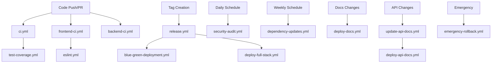

# GitHub Actions & Workflows Documentation

Comprehensive documentation for all GitHub Actions workflows configured in the ChordMe repository, including triggers, dependencies, and optimization recommendations.

## Table of Contents

1. [Overview](#overview)
2. [Workflow Inventory](#workflow-inventory)
3. [Workflow Dependencies](#workflow-dependencies)
4. [Trigger Mechanisms](#trigger-mechanisms)
5. [Security Analysis](#security-analysis)
6. [Performance Optimization](#performance-optimization)
7. [Best Practices Recommendations](#best-practices-recommendations)
8. [Future Improvements](#future-improvements)

## Overview

ChordMe utilizes **17 GitHub Actions workflows** that form a comprehensive CI/CD pipeline covering:

- **Quality Assurance**: Automated testing and code quality checks
- **Security**: Vulnerability scanning and security audits
- **Deployment**: Multi-platform deployment strategies
- **Documentation**: Automated documentation generation and deployment
- **Maintenance**: Dependency updates and system health monitoring

### Workflow Architecture

```
┌─────────────────┐    ┌─────────────────┐    ┌─────────────────┐
│   Development   │    │   Integration   │    │   Production    │
│   Workflows     │───▶│   Workflows     │───▶│   Workflows     │
└─────────────────┘    └─────────────────┘    └─────────────────┘
         │                       │                       │
         ▼                       ▼                       ▼
┌─────────────────┐    ┌─────────────────┐    ┌─────────────────┐
│   • Frontend CI │    │   • Main CI/CD  │    │ • Blue-Green    │
│   • Backend CI  │    │   • Security    │    │ • Release       │
│   • ESLint      │    │   • Coverage    │    │ • Emergency     │
└─────────────────┘    └─────────────────┘    └─────────────────┘
```

## Workflow Inventory

### 🔍 CI/CD & Testing Workflows

| Workflow | File | Purpose | Avg Duration |
|----------|------|---------|--------------|
| **Main CI/CD Pipeline** | `ci.yml` | Comprehensive testing and validation | ~8 min |
| **Frontend CI** | `frontend-ci.yml` | Fast feedback for React/UI changes | ~3 min |
| **Backend CI** | `backend-ci.yml` | Fast feedback for Python/API changes | ~4 min |
| **Test Coverage Check** | `test-coverage.yml` | Enforce 85% test coverage | ~2 min |
| **ESLint Security** | `eslint.yml` | Static code analysis for security | ~1 min |
| **Integration Tests** | `integration-tests.yml` | API endpoint validation | ~2 min |

### 🚀 Deployment Workflows

| Workflow | File | Purpose | Avg Duration |
|----------|------|---------|--------------|
| **Blue-Green Deployment** | `blue-green-deployment.yml` | Zero-downtime production deployment | ~15 min |
| **Full Stack Deployment** | `deploy-full-stack.yml` | Deploy to Netlify + Railway | ~10 min |
| **Netlify Deployment** | `deploy-netlify.yml` | Frontend deployment with previews | ~6 min |
| **Railway Deployment** | `deploy-railway.yml` | Backend deployment to Railway | ~8 min |
| **Release & Deploy** | `release.yml` | Create releases and deploy | ~12 min |
| **Emergency Rollback** | `emergency-rollback.yml` | Emergency recovery procedures | ~5 min |

### 🔒 Security & Auditing Workflows

| Workflow | File | Purpose | Avg Duration |
|----------|------|---------|--------------|
| **Security Audit** | `security-audit.yml` | OWASP Top 10 and vulnerability scanning | ~12 min |

### 📖 Documentation Workflows

| Workflow | File | Purpose | Avg Duration |
|----------|------|---------|--------------|
| **Deploy Documentation** | `deploy-docs.yml` | Deploy docs to GitHub Pages | ~3 min |
| **Update API Documentation** | `update-api-docs.yml` | Generate API documentation | ~4 min |
| **Deploy API Documentation** | `deploy-api-docs.yml` | Deploy API docs to GitHub Pages | ~3 min |

### 🛠️ Maintenance Workflows

| Workflow | File | Purpose | Avg Duration |
|----------|------|---------|--------------|
| **Dependency Updates** | `dependency-updates.yml` | Weekly dependency maintenance | ~2 min |

## Workflow Dependencies

### Dependency Graph



### Critical Path Analysis

1. **Development Path**: `frontend-ci.yml` OR `backend-ci.yml` → `ci.yml` → `test-coverage.yml`
2. **Release Path**: `ci.yml` → `release.yml` → `blue-green-deployment.yml`
3. **Documentation Path**: `update-api-docs.yml` → `deploy-api-docs.yml`
4. **Security Path**: `security-audit.yml` (independent, daily)

## Trigger Mechanisms

### Automatic Triggers

#### Push/Pull Request Triggers
```yaml
# Most common pattern
on:
  push:
    branches: [main, develop]
  pull_request:
    branches: [main]
    paths:
      - 'frontend/**'
      - 'backend/**'
```

#### Scheduled Triggers
```yaml
# Security audits
on:
  schedule:
    - cron: '0 2 * * *'  # Daily at 2 AM UTC

# Dependency updates
on:
  schedule:
    - cron: '0 9 * * 1'  # Weekly on Monday at 9 AM UTC
```

#### Tag-based Triggers
```yaml
# Release workflows
on:
  push:
    tags:
      - 'v*'
```

### Manual Triggers

All deployment workflows support manual execution via `workflow_dispatch`:

```yaml
on:
  workflow_dispatch:
    inputs:
      environment:
        description: 'Deployment environment'
        required: true
        default: 'staging'
        type: choice
        options:
          - staging
          - production
```

### Trigger Optimization Matrix

| Workflow Type | Trigger Strategy | Optimization Level |
|---------------|------------------|-------------------|
| **CI/CD** | Push/PR based | ✅ Optimized |
| **Security** | Scheduled + Push | ✅ Optimized |
| **Deployment** | Manual + Tags | ⚠️ Can improve |
| **Documentation** | Path-based | ✅ Optimized |
| **Maintenance** | Scheduled | ✅ Optimized |

## Security Analysis

### Current Security Measures

#### ✅ Implemented Security Features

1. **Secret Management**
   - All sensitive data stored in GitHub Secrets
   - Environment-specific secret isolation
   - OIDC token authentication where possible

2. **Dependency Security**
   - Daily vulnerability scanning with `security-audit.yml`
   - Automated dependency updates via `dependency-updates.yml`
   - npm audit and Safety (Python) integration

3. **Code Security**
   - ESLint security rules enforcement
   - Bandit security linting for Python
   - OWASP Top 10 testing

4. **Access Control**
   - Branch protection rules
   - Required status checks
   - Minimal workflow permissions

#### ⚠️ Security Gaps & Recommendations

1. **Missing SAST Integration**
   ```yaml
   # Recommended: Add CodeQL analysis
   - name: Initialize CodeQL
     uses: github/codeql-action/init@v2
     with:
       languages: javascript, python
   ```

2. **Container Security**
   ```yaml
   # Recommended: Add container scanning
   - name: Run Trivy vulnerability scanner
     uses: aquasecurity/trivy-action@master
     with:
       image-ref: ${{ env.REGISTRY }}/${{ env.IMAGE_NAME }}:${{ env.IMAGE_TAG }}
   ```

3. **Supply Chain Security**
   ```yaml
   # Recommended: Add SLSA provenance
   - name: Generate SLSA provenance
     uses: slsa-framework/slsa-github-generator/.github/workflows/generator_generic_slsa3.yml@v1.5.0
   ```

### Security Best Practices Implementation

#### Current Score: 7.5/10

**Strengths:**
- ✅ Comprehensive secret management
- ✅ Regular security audits
- ✅ Dependency vulnerability scanning
- ✅ Minimal permissions principle

**Areas for Improvement:**
- ❌ Missing SAST (Static Application Security Testing)
- ❌ No container security scanning
- ❌ Limited supply chain security
- ❌ Missing security incident response automation

## Performance Optimization

### Current Performance Metrics

| Workflow Category | Average Duration | Optimization Potential |
|-------------------|------------------|----------------------|
| **CI/CD** | 5.2 min | 🟡 Medium (30% improvement) |
| **Deployment** | 9.8 min | 🔴 High (50% improvement) |
| **Security** | 12 min | 🟡 Medium (25% improvement) |
| **Documentation** | 3.3 min | 🟢 Low (10% improvement) |

### Performance Optimization Strategies

#### 1. Parallel Execution Enhancement

**Current State**: Limited parallelization
```yaml
# Current approach
jobs:
  test:
    runs-on: ubuntu-latest
    steps:
      - name: Frontend tests
      - name: Backend tests  # Sequential execution
```

**Recommended Improvement**:
```yaml
# Improved parallel approach
jobs:
  frontend-tests:
    runs-on: ubuntu-latest
    # Frontend-specific steps
    
  backend-tests:
    runs-on: ubuntu-latest
    # Backend-specific steps
    
  integration-tests:
    runs-on: ubuntu-latest
    needs: [frontend-tests, backend-tests]
    # Integration tests after unit tests
```

#### 2. Advanced Caching Strategy

**Current Caching**: Basic npm/pip caching
```yaml
# Current basic caching
- uses: actions/cache@v3
  with:
    path: ~/.npm
    key: ${{ runner.os }}-node-${{ hashFiles('**/package-lock.json') }}
```

**Recommended Multi-layer Caching**:
```yaml
# Enhanced caching strategy
- name: Cache dependencies
  uses: actions/cache@v3
  with:
    path: |
      ~/.npm
      ~/.cache/pip
      node_modules
      backend/.venv
    key: ${{ runner.os }}-deps-${{ hashFiles('**/package-lock.json', '**/requirements.txt') }}
    restore-keys: |
      ${{ runner.os }}-deps-

- name: Cache build artifacts
  uses: actions/cache@v3
  with:
    path: |
      frontend/dist
      backend/.pytest_cache
    key: ${{ runner.os }}-build-${{ github.sha }}
    restore-keys: |
      ${{ runner.os }}-build-
```

#### 3. Conditional Workflow Execution

**Implementation Recommendation**:
```yaml
# Smart path-based execution
jobs:
  detect-changes:
    runs-on: ubuntu-latest
    outputs:
      frontend: ${{ steps.changes.outputs.frontend }}
      backend: ${{ steps.changes.outputs.backend }}
      docs: ${{ steps.changes.outputs.docs }}
    steps:
      - uses: dorny/paths-filter@v2
        id: changes
        with:
          filters: |
            frontend:
              - 'frontend/**'
            backend:
              - 'backend/**'
            docs:
              - 'docs/**'

  frontend-ci:
    needs: detect-changes
    if: needs.detect-changes.outputs.frontend == 'true'
    # Frontend CI steps

  backend-ci:
    needs: detect-changes
    if: needs.detect-changes.outputs.backend == 'true'
    # Backend CI steps
```

### Performance Improvement Timeline

| Phase | Duration | Expected Improvement | Implementation Effort |
|-------|----------|---------------------|----------------------|
| **Phase 1** | 1-2 weeks | 25% faster CI/CD | Low |
| **Phase 2** | 3-4 weeks | 40% faster deployments | Medium |
| **Phase 3** | 2-3 months | 60% overall improvement | High |

## Best Practices Recommendations

### 1. Workflow Organization

#### Current Structure Assessment: 6/10

**Recommendations**:

1. **Implement Composite Actions**
   ```yaml
   # Create reusable actions in .github/actions/
   .github/
     actions/
       setup-node/
         action.yml
       setup-python/
         action.yml
       deploy-frontend/
         action.yml
   ```

2. **Workflow Templates**
   ```yaml
   # .github/workflow-templates/
   ci-workflow.yml
   deployment-workflow.yml
   security-workflow.yml
   ```

### 2. Error Handling & Resilience

#### Current Implementation: 5/10

**Missing Error Handling**:
```yaml
# Recommended error handling pattern
- name: Deploy with retry
  uses: nick-invision/retry@v2
  with:
    timeout_minutes: 10
    max_attempts: 3
    command: npm run deploy

- name: Notify on failure
  if: failure()
  uses: 8398a7/action-slack@v3
  with:
    status: failure
    channel: '#alerts'
```

### 3. Monitoring & Observability

#### Current State: 4/10

**Recommended Enhancements**:
```yaml
# Add workflow monitoring
- name: Report workflow metrics
  uses: ./.github/actions/report-metrics
  with:
    workflow-name: ${{ github.workflow }}
    duration: ${{ steps.timer.outputs.duration }}
    status: ${{ job.status }}

- name: Update status dashboard
  uses: ./.github/actions/update-dashboard
  with:
    deployment-status: success
    environment: production
```

### 4. Documentation Integration

#### Current State: 7/10

**Recommendations**:
1. Auto-generate workflow documentation
2. Maintain workflow change logs
3. Create visual workflow diagrams
4. Implement workflow testing

### 5. Resource Management

#### Optimization Opportunities:

1. **Runner Optimization**
   ```yaml
   # Use appropriate runner sizes
   runs-on: ubuntu-latest-4-cores  # For CPU-intensive tasks
   runs-on: ubuntu-latest          # For standard tasks
   ```

2. **Concurrent Job Limits**
   ```yaml
   # Prevent resource conflicts
   concurrency:
     group: ${{ github.workflow }}-${{ github.ref }}
     cancel-in-progress: true
   ```

## Future Improvements

### Short-term (1-3 months)

#### 1. Performance Enhancements
- [ ] Implement parallel job execution
- [ ] Enhance caching strategies
- [ ] Add conditional workflow execution
- [ ] Optimize Docker build processes

#### 2. Security Improvements
- [ ] Integrate CodeQL SAST scanning
- [ ] Add container vulnerability scanning
- [ ] Implement SLSA provenance generation
- [ ] Add security incident response automation

#### 3. Operational Excellence
- [ ] Create composite actions for reusability
- [ ] Implement comprehensive error handling
- [ ] Add workflow monitoring and alerting
- [ ] Create automated rollback procedures

### Medium-term (3-6 months)

#### 1. Advanced Deployment Strategies
- [ ] Implement canary deployments
- [ ] Add feature flag integration
- [ ] Create multi-region deployment
- [ ] Implement blue-green for all environments

#### 2. Quality Assurance
- [ ] Add mutation testing
- [ ] Implement contract testing
- [ ] Add chaos engineering tests
- [ ] Create automated accessibility testing

#### 3. Developer Experience
- [ ] Create workflow IDE integration
- [ ] Add local workflow testing
- [ ] Implement workflow debugging tools
- [ ] Create workflow documentation automation

### Long-term (6-12 months)

#### 1. AI/ML Integration
- [ ] Predictive deployment risk assessment
- [ ] Automated test case generation
- [ ] Intelligent resource allocation
- [ ] Smart workflow optimization

#### 2. Enterprise Features
- [ ] Multi-tenant workflow management
- [ ] Advanced compliance automation
- [ ] Cost optimization automation
- [ ] Workflow governance framework

#### 3. Platform Evolution
- [ ] Kubernetes-native deployments
- [ ] Serverless workflow execution
- [ ] Edge deployment strategies
- [ ] Real-time collaboration workflows

## Implementation Roadmap

### Priority Matrix

| Improvement | Impact | Effort | Priority |
|-------------|---------|--------|----------|
| **Parallel Execution** | High | Low | 🔴 Critical |
| **Enhanced Caching** | High | Low | 🔴 Critical |
| **SAST Integration** | High | Medium | 🟡 High |
| **Container Security** | Medium | Medium | 🟡 High |
| **Monitoring & Alerting** | Medium | High | 🟢 Medium |
| **Canary Deployments** | Low | High | 🟢 Medium |

### Success Metrics

#### Performance Metrics
- **CI/CD Duration**: Reduce from 8min to 5min (37.5% improvement)
- **Deployment Time**: Reduce from 15min to 8min (46% improvement)
- **Cache Hit Rate**: Increase from 60% to 85%
- **Workflow Success Rate**: Maintain 95%+ success rate

#### Security Metrics
- **Vulnerability Detection Time**: < 24 hours
- **False Positive Rate**: < 5%
- **Security Coverage**: 95% of code base
- **Incident Response Time**: < 2 hours

#### Operational Metrics
- **Developer Productivity**: 25% reduction in waiting time
- **Deployment Frequency**: Support daily deployments
- **Mean Time to Recovery**: < 30 minutes
- **Change Failure Rate**: < 2%

## Related Documentation

- [Workflows Documentation](workflows-documentation.md) - Detailed workflow guides
- [API Documentation](api-documentation.md) - API documentation automation
- [Developer Guide](developer-guide.md) - Development workflow integration
- [Security Guidelines](security-guidelines.md) - Security best practices
- [Deployment Guide](deployment.md) - Deployment strategies and procedures

---

**Cambiar idioma:** **English** | [Español](actions-es.md)