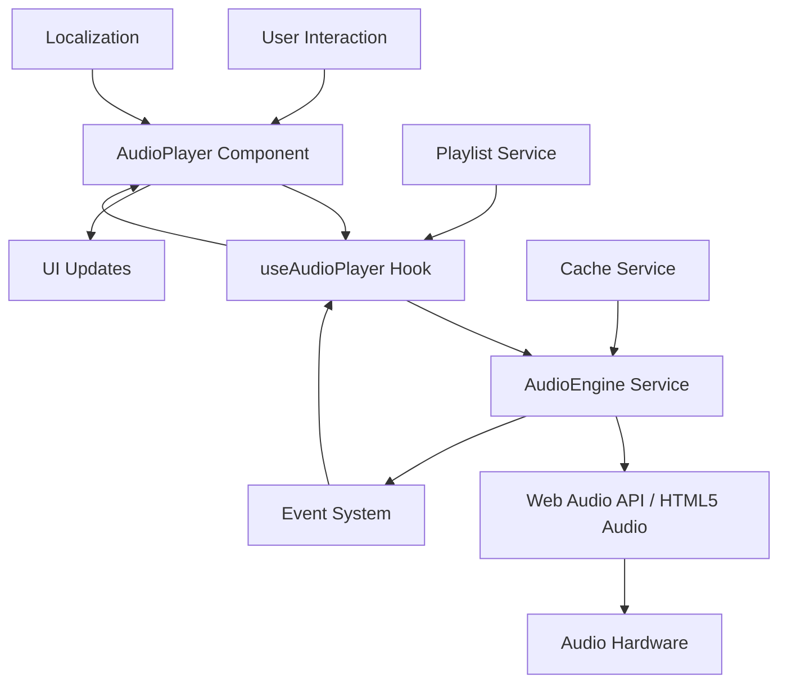

# ChordMe Audio Playback Engine Documentation

## Overview

The ChordMe Audio Playback Engine provides comprehensive audio playback capabilities for the ChordMe application, enabling users to play audio tracks alongside chord charts and lyrics. The engine supports multiple audio formats, advanced controls, visualization, and seamless integration with the existing ChordMe interface.

## Features

### 🎵 Audio Format Support
- **MP3**: MPEG Audio Layer III
- **WAV**: Waveform Audio File Format
- **OGG**: Ogg Vorbis compressed audio
- **AAC**: Advanced Audio Coding
- **M4A**: MPEG-4 Audio
- **FLAC**: Free Lossless Audio Codec (where supported)

### 🎛️ Playback Controls
- **Basic Controls**: Play, pause, stop, seek
- **Volume Control**: Linear volume adjustment (0-100%)
- **Playback Speed**: Variable speed control (0.5x to 2.0x)
- **Progress Bar**: Visual progress indicator with click-to-seek
- **Time Display**: Current time and total duration

### 📊 Audio Visualization
- **Real-time Frequency Spectrum**: Live frequency analysis
- **Waveform Display**: Visual representation of audio waveforms
- **Customizable Visualization**: Configurable colors, sizes, and styles
- **Performance Optimized**: Efficient rendering using Canvas API

### 🎼 Playlist Management
- **Create/Edit Playlists**: Full playlist CRUD operations
- **Drag & Drop Reordering**: Intuitive playlist management
- **Shuffle & Repeat**: Multiple playback modes
- **Track Metadata**: Title, artist, duration, format information
- **Play Count Tracking**: Usage statistics and history

### ⌨️ Keyboard Shortcuts
- **Space/K**: Play/Pause toggle
- **Ctrl+←/→**: Previous/Next track
- **←/→**: Seek backward/forward (10 seconds)
- **↑/↓**: Volume up/down
- **M**: Mute/unmute toggle
- **Ctrl+S**: Stop playback
- **Esc**: Clear error messages

### ♿ Accessibility Features
- **Screen Reader Support**: Comprehensive ARIA labels
- **Keyboard Navigation**: Full keyboard accessibility
- **High Contrast Mode**: Support for high contrast themes
- **Reduced Motion**: Respects prefers-reduced-motion
- **Focus Management**: Clear focus indicators

### 🎨 Theming & Customization
- **Theme Support**: Light, dark, and auto themes
- **Compact Mode**: Space-efficient layout option
- **CSS Custom Properties**: Easy customization
- **Responsive Design**: Mobile-first responsive layout

## Architecture

### Core Components

#### AudioEngine (`services/audioEngine.ts`)
The heart of the audio system, implementing:
- **Web Audio API**: Primary audio implementation for advanced features
- **HTML5 Audio Fallback**: Compatibility layer for older browsers
- **Event System**: Comprehensive event handling for state changes
- **Error Handling**: Robust error recovery and user feedback

#### AudioPlayer Component (`components/AudioPlayer/`)
Main UI component providing:
- **Control Interface**: Visual controls for all playback functions
- **Progress Display**: Real-time progress and time information
- **Playlist View**: Integrated playlist management interface
- **Error Display**: User-friendly error messages and recovery options

#### useAudioPlayer Hook (`hooks/useAudioPlayer.ts`)
React hook for state management:
- **State Synchronization**: Real-time audio state updates
- **Event Handling**: Centralized event management
- **Utility Functions**: Helper functions for time formatting, etc.
- **Configuration Management**: Centralized configuration handling

#### Audio Types (`types/audio.ts`)
Comprehensive TypeScript definitions:
- **Interface Definitions**: All audio-related type definitions
- **Enum Types**: Audio formats, states, error codes
- **Configuration Types**: Structured configuration options
- **Event Types**: Type-safe event handling

### Data Flow



## Browser Compatibility

### Primary Support (Web Audio API)
- **Chrome**: 66+ (full features)
- **Firefox**: 60+ (full features)
- **Safari**: 14+ (full features)
- **Edge**: 79+ (full features)

### Fallback Support (HTML5 Audio)
- **Chrome**: 30+ (basic features)
- **Firefox**: 25+ (basic features)
- **Safari**: 10+ (basic features)
- **Edge**: 12+ (basic features)
- **Internet Explorer**: 11+ (limited features)

### Mobile Support
- **iOS Safari**: 14+ (full features)
- **Chrome Mobile**: 66+ (full features)
- **Samsung Internet**: 10+ (full features)
- **Firefox Mobile**: 60+ (full features)

## Performance Considerations

### Audio Processing
- **Efficient Buffering**: Optimized buffer management for smooth playback
- **Memory Management**: Automatic cleanup of audio resources
- **CPU Optimization**: Minimal CPU usage during playback
- **Background Processing**: Non-blocking audio operations

### Caching Strategy
- **Smart Preloading**: Intelligent track preloading based on playlist order
- **Storage Management**: Automatic cache size management
- **Compression**: Optional audio compression for storage efficiency
- **TTL Management**: Time-based cache expiration

### Visualization Performance
- **Throttled Updates**: Controlled frame rate for smooth visualization
- **Canvas Optimization**: Efficient Canvas API usage
- **Memory Pooling**: Reused visualization buffers
- **Background Processing**: Off-main-thread audio analysis

## Configuration Options

### AudioEngine Configuration
```typescript
const config: PlaybackConfig = {
  volume: 1.0,                    // Initial volume (0-1)
  playbackRate: 1.0,              // Initial playback speed (0.5-2.0)
  loop: false,                    // Loop current track
  shuffle: false,                 // Shuffle playlist
  crossfade: {
    enabled: false,               // Enable crossfade
    duration: 2,                  // Crossfade duration (seconds)
    type: 'linear'                // Crossfade curve type
  },
  preloadNext: true,              // Preload next track
  gaplessPlayback: false          // Enable gapless playback
};
```

### Visualization Configuration
```typescript
const visualConfig: VisualizationConfig = {
  type: 'spectrum',               // Visualization type
  fftSize: 2048,                  // FFT size for analysis
  smoothingTimeConstant: 0.8,     // Smoothing factor
  minDecibels: -100,              // Minimum dB level
  maxDecibels: -30,               // Maximum dB level
  height: 100,                    // Canvas height
  width: 300,                     // Canvas width
  color: '#007acc',               // Primary color
  backgroundColor: '#1a1a1a',     // Background color
  responsive: true                // Responsive sizing
};
```

### Cache Configuration
```typescript
const cacheConfig: AudioCacheConfig = {
  maxSize: 100 * 1024 * 1024,     // 100MB cache limit
  maxEntries: 50,                 // Maximum cached tracks
  ttl: 24 * 60 * 60,              // 24 hour TTL
  preloadNext: true,              // Preload next tracks
  preloadCount: 2,                // Number of tracks to preload
  compressionEnabled: false,      // Enable compression
  persistToStorage: true          // Persist cache to localStorage
};
```

## API Reference

### AudioEngine Methods

#### Playback Control
```typescript
// Basic playback controls
await audioEngine.play();
audioEngine.pause();
audioEngine.stop();
audioEngine.seek(timeInSeconds);

// Volume and speed control
audioEngine.setVolume(0.8);        // 80% volume
audioEngine.setPlaybackRate(1.5);  // 1.5x speed
```

#### Track Management
```typescript
// Load audio track
const audioSource: AudioSource = {
  id: 'track-1',
  url: 'https://example.com/audio.mp3',
  title: 'Song Title',
  artist: 'Artist Name',
  duration: 180,
  format: 'mp3',
  quality: 'high'
};

await audioEngine.loadTrack(audioSource);

// Preload for better performance
await audioEngine.preloadTrack(audioSource);
```

#### Event Handling
```typescript
// Listen for audio events
audioEngine.addEventListener('statechange', (event) => {
  console.log('State changed from', event.previousState, 'to', event.state);
});

audioEngine.addEventListener('timeupdate', (event) => {
  console.log('Progress:', event.progress * 100, '%');
});

audioEngine.addEventListener('error', (event) => {
  console.error('Audio error:', event.error.message);
});
```

### useAudioPlayer Hook

```typescript
const {
  // State
  state,
  isPlaying,
  isPaused,
  isStopped,
  isLoading,
  hasError,
  visualizationData,
  
  // Controls
  play,
  pause,
  stop,
  seek,
  setVolume,
  setPlaybackRate,
  
  // Track management
  loadTrack,
  loadPlaylist,
  nextTrack,
  previousTrack,
  
  // Utilities
  formatTime,
  getProgress,
  clearError
} = useAudioPlayer({
  autoPlay: false,
  enableVisualization: true,
  onTrackChange: (track) => console.log('Now playing:', track.title),
  onError: (error) => console.error('Audio error:', error.message)
});
```

## Error Handling

### Error Types
The audio engine provides comprehensive error handling for various scenarios:

- **NetworkError**: Issues loading audio from remote sources
- **DecodeError**: Problems decoding audio data
- **NotSupported**: Unsupported audio formats or browser features
- **PermissionDenied**: Browser blocks audio access
- **InvalidSource**: Invalid or corrupted audio sources
- **PlaybackFailed**: General playback failures
- **BufferUnderrun**: Audio buffer issues
- **DeviceBusy**: Audio device conflicts
- **QuotaExceeded**: Storage quota limits
- **CrossfadeFailed**: Crossfade operation failures

### Error Recovery
The engine implements several recovery strategies:

1. **Automatic Fallback**: Web Audio API → HTML5 Audio
2. **Retry Logic**: Automatic retry for transient network errors
3. **Graceful Degradation**: Disable features when not supported
4. **User Notification**: Clear error messages with recovery suggestions

## Integration Guide

### Basic Integration

```typescript
import { AudioPlayer } from '../components/AudioPlayer';
import { AudioSource, Playlist } from '../types/audio';

const MyComponent: React.FC = () => {
  const playlist: Playlist = {
    id: 'my-playlist',
    name: 'My Songs',
    items: [/* playlist items */],
    // ... other playlist properties
  };

  return (
    <AudioPlayer
      playlist={playlist}
      showVisualization={true}
      keyboardShortcuts={true}
      onTrackChange={(track) => console.log('Playing:', track.title)}
    />
  );
};
```

### Advanced Integration

```typescript
import { useAudioPlayer } from '../hooks/useAudioPlayer';
import { audioEngine } from '../services/audioEngine';

const AdvancedPlayer: React.FC = () => {
  const {
    state,
    play,
    pause,
    setVolume,
    visualizationData
  } = useAudioPlayer({
    enableVisualization: true
  });

  // Custom visualization
  useEffect(() => {
    if (visualizationData && canvasRef.current) {
      drawVisualization(canvasRef.current, visualizationData);
    }
  }, [visualizationData]);

  // Custom controls
  return (
    <div>
      <button onClick={state.isPlaying ? pause : play}>
        {state.isPlaying ? 'Pause' : 'Play'}
      </button>
      <input
        type="range"
        min="0"
        max="1"
        step="0.01"
        value={state.volume}
        onChange={(e) => setVolume(parseFloat(e.target.value))}
      />
      <canvas ref={canvasRef} />
    </div>
  );
};
```

## Troubleshooting

### Common Issues

#### Audio Not Playing
1. Check browser audio permissions
2. Verify audio source URL accessibility
3. Ensure supported audio format
4. Check for browser autoplay restrictions

#### Poor Performance
1. Reduce visualization frequency
2. Disable audio caching if memory-constrained
3. Use lower quality audio sources
4. Limit concurrent audio processing

#### Visualization Not Working
1. Verify Web Audio API support
2. Check canvas element availability
3. Ensure audio context is not suspended
4. Verify visualization data generation

#### Mobile Issues
1. Check iOS/Safari autoplay restrictions
2. Verify mobile browser compatibility
3. Test touch interaction requirements
4. Check mobile data usage settings

### Debug Information

Enable debug logging:
```typescript
// Enable detailed logging
localStorage.setItem('chordme-audio-debug', 'true');

// Check audio capabilities
console.log(audioEngine.getCapabilities());

// Monitor audio state
audioEngine.addEventListener('statechange', console.log);
```

## Testing

### Unit Testing
The audio engine includes comprehensive unit tests:

```bash
# Run audio engine tests
npm run test -- src/services/audioEngine.test.ts

# Run audio player component tests
npm run test -- src/components/AudioPlayer/

# Run audio hook tests
npm run test -- src/hooks/useAudioPlayer.test.ts
```

### Integration Testing
Test audio functionality across different environments:

1. **Browser Compatibility**: Test on multiple browsers
2. **Audio Format Support**: Verify format handling
3. **Performance Testing**: Test with large playlists
4. **Mobile Testing**: Verify mobile functionality
5. **Accessibility Testing**: Test screen reader compatibility

### Manual Testing
Use the audio demo page for manual testing:

```
http://localhost:5173/#audio-demo
```

## Security Considerations

### Content Security Policy
Ensure CSP allows audio sources:
```
Content-Security-Policy: media-src 'self' https:;
```

### Cross-Origin Requests
Configure CORS for remote audio sources:
```javascript
audioElement.crossOrigin = 'anonymous';
```

### Privacy
- Audio usage tracking is optional
- Cache data is stored locally only
- No audio content is transmitted to external services

## Future Enhancements

### Planned Features
- **Crossfade Support**: Smooth transitions between tracks
- **Audio Effects**: Equalizer, reverb, compression
- **Streaming Support**: Live audio streaming capabilities
- **Offline Mode**: Download tracks for offline playback
- **Synchronization**: Sync audio with chord progression
- **Machine Learning**: Automatic tempo and key detection

### Performance Optimizations
- **Web Workers**: Off-main-thread audio processing
- **Streaming Buffers**: Progressive audio loading
- **Advanced Caching**: Predictive caching algorithms
- **Compression**: Improved audio compression

---

*Last updated: December 2024*  
*Version: 1.0.0*