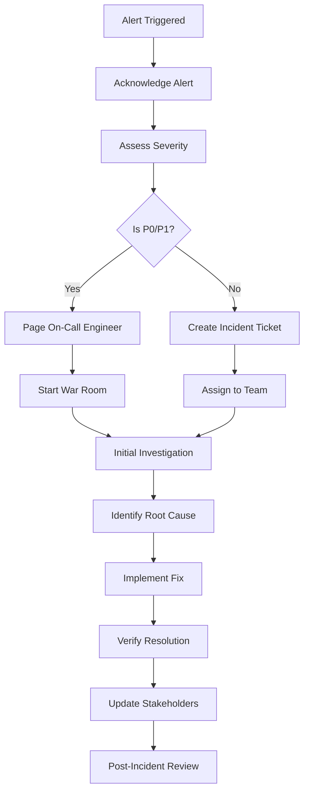

# ChordMe Operations Manual

## Table of Contents

1. [Monitoring Architecture](#monitoring-architecture)
2. [Metric Definitions](#metric-definitions)
3. [Alerting Rules](#alerting-rules)
4. [Incident Response Procedures](#incident-response-procedures)
5. [Runbooks](#runbooks)
6. [Troubleshooting Guide](#troubleshooting-guide)
7. [Emergency Contacts](#emergency-contacts)

## Monitoring Architecture

### Overview

ChordMe uses a comprehensive monitoring stack that includes:

- **Application Performance Monitoring (APM)**: Sentry, New Relic, Datadog integration
- **Centralized Logging**: Structured logging with JSON format for ELK/CloudWatch compatibility
- **Real-time Metrics**: Performance metrics collection and threshold monitoring
- **Frontend Monitoring**: Error tracking and Core Web Vitals monitoring
- **Infrastructure Monitoring**: AWS CloudWatch, container metrics

### Architecture Diagram

```
┌─────────────────┐    ┌─────────────────┐    ┌─────────────────┐
│   Frontend      │    │    Backend      │    │  Infrastructure │
│                 │    │                 │    │                 │
│ • Error Boundary│    │ • Health Checks │    │ • CloudWatch    │
│ • Core Web      │    │ • Metrics       │    │ • ECS Metrics   │
│   Vitals        │───▶│   Collection    │───▶│ • RDS Metrics   │
│ • API Tracking  │    │ • Structured    │    │ • ALB Metrics   │
│                 │    │   Logging       │    │                 │
└─────────────────┘    └─────────────────┘    └─────────────────┘
         │                       │                       │
         │                       │                       │
         ▼                       ▼                       ▼
┌─────────────────────────────────────────────────────────────────┐
│                    Monitoring Stack                             │
│                                                                 │
│  ┌─────────────┐  ┌─────────────┐  ┌─────────────┐            │
│  │   Sentry    │  │ New Relic / │  │   Custom    │            │
│  │             │  │  Datadog    │  │ Dashboards  │            │
│  │ Error       │  │             │  │             │            │
│  │ Tracking    │  │ APM &       │  │ Metrics &   │            │
│  │ &           │  │ Infrastructure│  │ Logs       │            │
│  │ Performance │  │ Monitoring  │  │             │            │
│  └─────────────┘  └─────────────┘  └─────────────┘            │
│                                                                 │
│  ┌─────────────────────────────────────────────────────────┐   │
│  │              Alert Manager                              │   │
│  │                                                         │   │
│  │  ┌─────────────┐  ┌─────────────┐  ┌─────────────┐     │   │
│  │  │   Slack     │  │   Email     │  │  Webhooks   │     │   │
│  │  │Notifications│  │ Notifications│  │   (Custom)  │     │   │
│  │  └─────────────┘  └─────────────┘  └─────────────┘     │   │
│  └─────────────────────────────────────────────────────────┘   │
└─────────────────────────────────────────────────────────────────┘
```

### Components

#### 1. Frontend Monitoring
- **Error Boundary**: Catches React component errors
- **Performance Tracking**: Core Web Vitals (LCP, FID, CLS)
- **API Monitoring**: Response times and error rates
- **User Session Tracking**: Error correlation with user activities

#### 2. Backend Monitoring
- **Health Checks**: Database connectivity and application health
- **Metrics Collection**: Request rates, response times, error rates
- **Structured Logging**: JSON format for easy parsing
- **Performance Monitoring**: Database query times, CPU/memory usage

#### 3. Infrastructure Monitoring
- **AWS CloudWatch**: ECS, RDS, ALB metrics
- **Container Metrics**: CPU, memory, disk usage
- **Network Metrics**: Latency, throughput, error rates

#### 4. APM Integration
- **Sentry**: Error tracking and performance monitoring
- **New Relic**: Application performance and infrastructure monitoring
- **Datadog**: Full-stack observability and analytics

## Metric Definitions

### Application Metrics

| Metric | Description | Unit | Normal Range | Alert Threshold |
|--------|-------------|------|--------------|-----------------|
| Error Rate | Percentage of failed requests | % | 0-0.5% | >1% |
| Response Time | Average API response time | ms | 50-300ms | >500ms |
| Throughput | Requests per minute | req/min | Varies | N/A |
| Database Response Time | Average DB query time | ms | 5-50ms | >100ms |
| Active Users | Concurrent active users | count | Varies | N/A |

### Infrastructure Metrics

| Metric | Description | Unit | Normal Range | Alert Threshold |
|--------|-------------|------|--------------|-----------------|
| CPU Usage | Container CPU utilization | % | 10-60% | >80% |
| Memory Usage | Container memory usage | % | 20-70% | >85% |
| Disk Usage | Available disk space | % | 10-80% | >90% |
| Network I/O | Network throughput | MB/s | Varies | N/A |
| Database Connections | Active DB connections | count | 1-10 | >50 |

### Frontend Metrics

| Metric | Description | Unit | Good | Needs Improvement |
|--------|-------------|------|------|-------------------|
| LCP (Largest Contentful Paint) | Loading performance | ms | <2.5s | >2.5s |
| FID (First Input Delay) | Interactivity | ms | <100ms | >100ms |
| CLS (Cumulative Layout Shift) | Visual stability | score | <0.1 | >0.1 |
| Page Load Time | Complete page load | ms | <3s | >3s |

## Alerting Rules

### Critical Alerts (Immediate Response Required)

1. **Service Unavailable**
   - **Condition**: Health check fails for >2 minutes
   - **Severity**: Critical
   - **Notification**: Slack + Email + SMS
   - **Response Time**: <5 minutes

2. **High Error Rate**
   - **Condition**: Error rate >5% for >5 minutes
   - **Severity**: Critical
   - **Notification**: Slack + Email
   - **Response Time**: <10 minutes

3. **Database Connectivity Issues**
   - **Condition**: Database connection failures >50% for >2 minutes
   - **Severity**: Critical
   - **Notification**: Slack + Email + SMS
   - **Response Time**: <5 minutes

### High Priority Alerts

1. **Elevated Error Rate**
   - **Condition**: Error rate >1% for >10 minutes
   - **Severity**: High
   - **Notification**: Slack + Email
   - **Response Time**: <30 minutes

2. **High Response Times**
   - **Condition**: Average response time >500ms for >10 minutes
   - **Severity**: High
   - **Notification**: Slack
   - **Response Time**: <30 minutes

3. **Resource Exhaustion**
   - **Condition**: CPU >80% or Memory >85% for >15 minutes
   - **Severity**: High
   - **Notification**: Slack
   - **Response Time**: <60 minutes

### Medium Priority Alerts

1. **Performance Degradation**
   - **Condition**: Response time >300ms for >30 minutes
   - **Severity**: Medium
   - **Notification**: Slack
   - **Response Time**: <2 hours

2. **Frontend Performance Issues**
   - **Condition**: LCP >2.5s or FID >100ms for >20 occurrences
   - **Severity**: Medium
   - **Notification**: Slack
   - **Response Time**: <4 hours

### Alert Configuration

```bash
# Environment Variables for Alert Configuration
SLACK_WEBHOOK_URL=https://hooks.slack.com/services/YOUR/SLACK/WEBHOOK
CUSTOM_ALERT_WEBHOOK=https://your-alert-system.com/webhook
ALERT_EMAIL_CONFIG={"smtp_server": "smtp.example.com", "recipients": ["ops@example.com"]}

# Alert Thresholds (configurable per environment)
ALERT_THRESHOLDS='{"error_rate_percent": 1.0, "response_time_ms": 500, "cpu_usage_percent": 80}'
```

## Incident Response Procedures

### 1. Incident Classification

#### Severity Levels

- **P0 (Critical)**: Complete service outage, data loss, security breach
- **P1 (High)**: Major feature unavailable, significant performance degradation
- **P2 (Medium)**: Minor feature issues, moderate performance impact
- **P3 (Low)**: Cosmetic issues, minimal user impact

#### Response Times

- **P0**: 5 minutes
- **P1**: 30 minutes
- **P2**: 2 hours
- **P3**: Next business day

### 2. Incident Response Workflow



### 3. Communication Templates

#### Initial Alert Notification
```
🚨 INCIDENT ALERT - P{severity}
Service: ChordMe
Issue: {brief_description}
Started: {timestamp}
Impact: {user_impact}
Status: Investigating
Lead: {incident_commander}
Updates: Every 15 minutes
```

#### Status Update
```
📊 INCIDENT UPDATE - P{severity}
Service: ChordMe
Issue: {brief_description}
Status: {current_status}
ETA: {estimated_resolution}
Actions: {current_actions}
Next Update: {next_update_time}
```

#### Resolution Notice
```
✅ INCIDENT RESOLVED - P{severity}
Service: ChordMe
Issue: {brief_description}
Duration: {total_duration}
Root Cause: {root_cause_summary}
Fix: {resolution_summary}
Follow-up: {post_incident_actions}
```

## Runbooks

### Service Downtime

#### Symptoms
- Health checks failing
- Users cannot access the application
- 5xx errors in logs

#### Investigation Steps

1. **Check Application Health**
   ```bash
   # Check backend health
   curl -f https://api.chordme.com/api/v1/health
   
   # Check frontend accessibility
   curl -f https://chordme.com
   
   # Check detailed health status
   curl https://api.chordme.com/api/v1/monitoring/health-detailed
   ```

2. **Check Infrastructure**
   ```bash
   # AWS ECS Service Status
   aws ecs describe-services --cluster chordme-cluster --services chordme-backend
   
   # Check load balancer health
   aws elbv2 describe-target-health --target-group-arn arn:aws:elasticloadbalancing:...
   
   # Check database connectivity
   aws rds describe-db-instances --db-instance-identifier chordme-db
   ```

3. **Check Logs**
   ```bash
   # Application logs
   aws logs tail /aws/ecs/chordme-backend --follow
   
   # Infrastructure logs
   aws logs tail /aws/ecs/containerinsights/chordme-cluster/performance --follow
   ```

#### Resolution Steps

1. **If Application Issue**
   - Check recent deployments
   - Rollback to previous version if needed
   - Restart application containers

2. **If Infrastructure Issue**
   - Check AWS service status
   - Verify security groups and network configuration
   - Scale up resources if needed

3. **If Database Issue**
   - Check database status and connectivity
   - Verify connection pool settings
   - Check for long-running queries

#### Recovery Verification
```bash
# Verify service recovery
curl -f https://api.chordme.com/api/v1/health
curl -f https://chordme.com

# Run smoke tests
python tests/deployment/smoke_tests.py

# Monitor metrics for 15 minutes
curl https://api.chordme.com/api/v1/monitoring/metrics
```

### High Error Rates

#### Symptoms
- Error rate >1% for extended period
- Increased 4xx/5xx responses
- User complaints about functionality

#### Investigation Steps

1. **Identify Error Patterns**
   ```bash
   # Check error logs
   aws logs filter-log-events --log-group-name /aws/ecs/chordme-backend \
     --filter-pattern "ERROR"
   
   # Check metrics
   curl https://api.chordme.com/api/v1/monitoring/metrics
   ```

2. **Analyze Error Types**
   - Review error messages and stack traces
   - Check if errors are concentrated on specific endpoints
   - Verify if errors correlate with recent changes

3. **Check Dependencies**
   - Database connectivity and performance
   - External API availability
   - Third-party service status

#### Resolution Steps

1. **For Application Errors**
   - Fix code issues and deploy
   - Rollback if critical
   - Add error handling for edge cases

2. **For Dependency Issues**
   - Implement circuit breakers
   - Add retry logic
   - Switch to backup services if available

3. **For Rate Limiting Issues**
   - Increase rate limits if appropriate
   - Implement proper error responses
   - Add caching where possible

### High Response Times

#### Symptoms
- Average response time >500ms
- User complaints about slow performance
- Timeouts in logs

#### Investigation Steps

1. **Identify Bottlenecks**
   ```bash
   # Check application performance
   curl https://api.chordme.com/api/v1/monitoring/metrics
   
   # Check database performance
   # AWS RDS Performance Insights or query logs
   ```

2. **Analyze Performance Patterns**
   - Check if slowness affects all endpoints or specific ones
   - Verify if issue correlates with traffic spikes
   - Review recent code changes

3. **Check Resource Usage**
   ```bash
   # Check container resources
   aws ecs describe-tasks --cluster chordme-cluster
   
   # Check database metrics
   aws rds describe-db-instances --db-instance-identifier chordme-db
   ```

#### Resolution Steps

1. **For Database Issues**
   - Optimize slow queries
   - Add database indexes
   - Scale database resources

2. **For Application Issues**
   - Optimize code performance
   - Add caching
   - Implement async processing

3. **For Infrastructure Issues**
   - Scale application containers
   - Optimize load balancer configuration
   - Implement CDN for static assets

### Frontend Performance Issues

#### Symptoms
- Core Web Vitals above thresholds
- User reports of slow page loads
- High frontend metrics in monitoring

#### Investigation Steps

1. **Check Frontend Metrics**
   ```bash
   # Check frontend performance data
   curl https://api.chordme.com/api/v1/monitoring/frontend-metrics
   ```

2. **Analyze Performance**
   - Use Lighthouse for performance audit
   - Check Core Web Vitals in production
   - Review bundle size and loading times

#### Resolution Steps

1. **Optimize Loading Performance**
   - Implement code splitting
   - Optimize images and assets
   - Use CDN for static resources

2. **Improve Interactivity**
   - Reduce JavaScript bundle size
   - Implement lazy loading
   - Optimize React component rendering

3. **Fix Layout Stability**
   - Set explicit dimensions for images
   - Avoid inserting content above existing content
   - Use CSS containment

## Troubleshooting Guide

### Common Issues

#### 1. Authentication Errors

**Symptoms**: 401/403 errors, login failures
**Causes**: JWT token expiration, invalid credentials, CORS issues
**Solutions**:
- Check JWT token validity and expiration
- Verify user credentials in database
- Review CORS configuration

#### 2. Database Connection Issues

**Symptoms**: Connection timeouts, pool exhaustion
**Causes**: Network issues, connection limit exceeded, database overload
**Solutions**:
- Check database connectivity
- Adjust connection pool settings
- Scale database resources

#### 3. Memory Leaks

**Symptoms**: Gradually increasing memory usage, container restarts
**Causes**: Unclosed connections, memory leaks in code
**Solutions**:
- Profile application memory usage
- Check for unclosed database connections
- Review code for memory leaks

#### 4. Performance Degradation

**Symptoms**: Slow response times, high CPU usage
**Causes**: Inefficient queries, N+1 problems, lack of caching
**Solutions**:
- Optimize database queries
- Implement proper caching
- Add database indexes

### Diagnostic Commands

```bash
# Check application status
kubectl get pods -l app=chordme
docker ps | grep chordme

# Check logs
kubectl logs -l app=chordme --tail=100
docker logs chordme-backend --tail=100

# Check resource usage
kubectl top pods
docker stats

# Check network connectivity
kubectl exec -it pod-name -- ping database-host
curl -v https://api.chordme.com/api/v1/health

# Database diagnostics
psql -h database-host -U username -d chordme -c "SELECT * FROM pg_stat_activity;"
```

## Emergency Contacts

### On-Call Rotation

| Role | Primary | Secondary | Phone | Email |
|------|---------|-----------|-------|-------|
| DevOps Engineer | John Doe | Jane Smith | +1-555-0100 | devops@chordme.com |
| Backend Developer | Alice Johnson | Bob Wilson | +1-555-0200 | backend@chordme.com |
| Frontend Developer | Carol Brown | David Lee | +1-555-0300 | frontend@chordme.com |

### Escalation Path

1. **Level 1**: On-Call Engineer (5 minutes response)
2. **Level 2**: Team Lead (15 minutes response)
3. **Level 3**: Engineering Manager (30 minutes response)
4. **Level 4**: CTO (60 minutes response)

### External Contacts

- **AWS Support**: 1-800-AWS-SUPPORT (Critical issues)
- **Sentry Support**: support@sentry.io
- **Database Vendor**: support@provider.com

### Communication Channels

- **Primary**: Slack #incidents channel
- **Secondary**: Email distribution list
- **Emergency**: Phone calls
- **Status Page**: https://status.chordme.com

---

## Monitoring Dashboard URLs

- **Application Dashboard**: https://grafana.chordme.com/d/app-overview
- **Infrastructure Dashboard**: https://grafana.chordme.com/d/infra-overview
- **Sentry Dashboard**: https://sentry.io/organizations/chordme/
- **AWS CloudWatch**: https://console.aws.amazon.com/cloudwatch/
- **Status Page**: https://status.chordme.com

## Document Maintenance

- **Last Updated**: 2024-01-01
- **Review Cycle**: Monthly
- **Owner**: DevOps Team
- **Approvers**: Engineering Manager, SRE Lead

For questions or updates to this document, please contact: devops@chordme.com